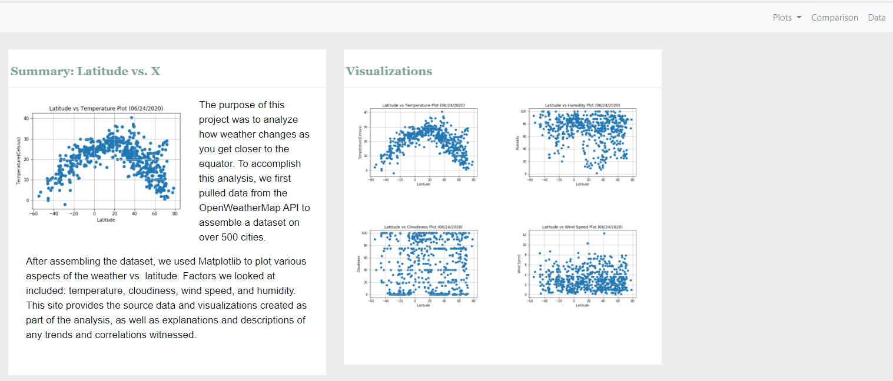

## Web Visualization Dashboard (Latitude)

This assignment was to create a Web Visualization Dashboard of weather in more than 500 cities at different latitudes relative to the equator line. 

The Dashboard was built using HTML, CSS, and Bootstrap.  

The visualizations include latitude versus temperature, humidity, cloudiness, and windspeed.

The Web Visualization Dashboard consists of the following:

    * A landing page containing:
     
       * An explanation of the project
       
       * Links to each visualizations page 
       
       * A descriptive title and heading tag
       
       * The visualization for the selected comparison
       
       * A paragraph describing the plot and its significance
       
    * A Comparisons page that:
    
       * Contains all of the visualizations on the same page 
       
    * A Data page that displays a responsive table containing the data used in the visualizations
   
   
   The Web Visualization Dashboard is at https://sj429.github.io/WebDesign/

